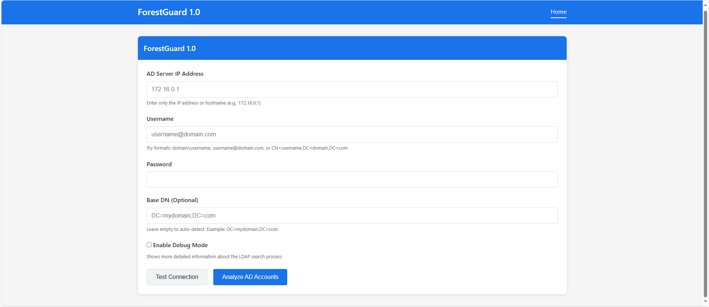
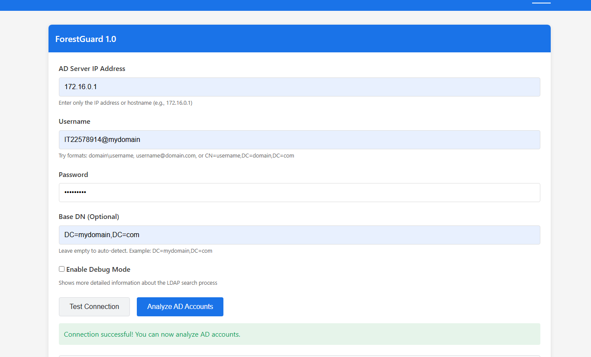
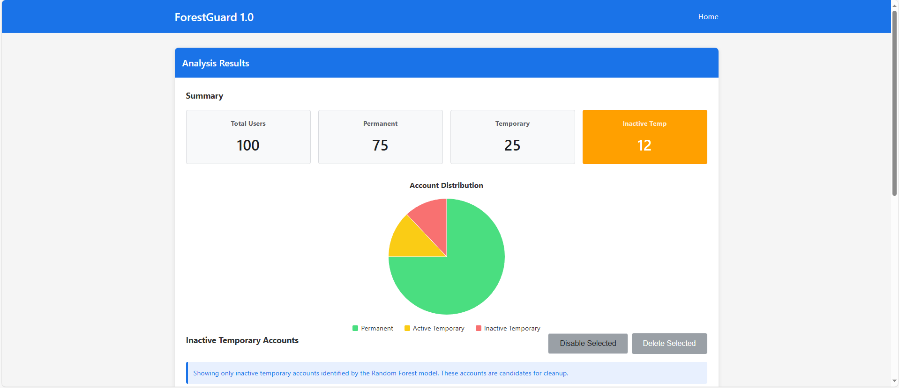
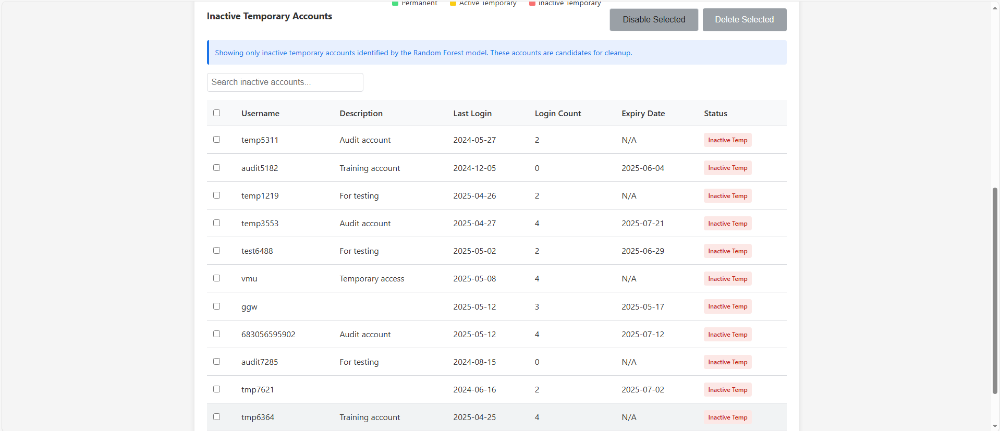

# ForestGuard 1.0

### Detecting and Managing Temporary and Inactive Active Directory Accounts Using Machine Learning

<div align="center">


**Machine Learning-Based Active Directory Security Platform**

</div>

---

## Overview

ForestGuard 1.0 is a cybersecurity-focused web application designed to identify, monitor, and manage temporary and inactive user accounts within Microsoft Active Directory environments.

The platform combines machine learning, Active Directory integration, and automated account monitoring to reduce security risks caused by forgotten test accounts, inactive accounts, and improperly managed user identities.

The solution integrates directly with Active Directory using LDAP and provides administrators with a centralized dashboard for account analysis, monitoring, and remediation.

---

## Problem Statement

Organizations frequently create temporary accounts for:

* Software testing
* System maintenance
* Troubleshooting
* Development activities

These accounts are often forgotten after use and may remain active for extended periods, increasing the organization's attack surface.

ForestGuard addresses this challenge by automatically identifying suspicious, temporary, and inactive accounts using machine learning techniques and presenting them for administrative review.

---

# Key Features

### Active Directory Integration

* Secure LDAP connectivity
* Account metadata retrieval
* Organizational Unit (OU) support
* User account analysis

### Machine Learning Detection

* Isolation Forest anomaly detection
* Random Forest inactivity classification
* Automated account risk evaluation

### Administrative Dashboard

* Summary statistics
* Account monitoring
* Search and filtering
* Visualization dashboards
* Security notifications

### Security Operations

* Flagging suspicious accounts
* Identifying inactive accounts
* Supporting account deactivation workflows
* Improving account governance

---

# System Architecture

```text
                   ┌─────────────────────┐
                   │ Active Directory    │
                   │ Windows Server      │
                   └──────────┬──────────┘
                              │ LDAP
                              ▼
                 ┌─────────────────────────┐
                 │ ForestGuard Backend     │
                 │ Flask Application       │
                 └──────────┬──────────────┘
                            │
         ┌──────────────────┼──────────────────┐
         ▼                  ▼                  ▼

 Isolation Forest    Random Forest      Dashboard Engine
 Anomaly Detection   Classification      Visualization

         └──────────────────┼──────────────────┘
                            ▼
                 Administrative Dashboard
```

---

# Machine Learning Pipeline

```text
Active Directory Accounts
            ↓
      Data Collection
            ↓
      Feature Extraction
            ↓
 Isolation Forest Model
            ↓
Temporary Accounts Identified
            ↓
 Random Forest Model
            ↓
Inactive Account Detection
            ↓
 Administrator Review
            ↓
 Account Management Actions
```

---

# Models Used

## Isolation Forest

Purpose:

* Detect temporary accounts
* Identify anomalous account behavior

Features Used:

* Login Count
* Username Pattern
* Account Description
* Expiration Status

### Performance

| Metric   | Value |
| -------- | ----- |
| Accuracy | 92%   |

---

## Random Forest

Purpose:

* Classify inactive accounts
* Reduce false positives

Features Used:

* Last Login Days

### Performance

| Metric   | Value |
| -------- | ----- |
| Accuracy | 95%   |

---

# Technologies Used

## Backend

* Python
* Flask
* LDAP3

## Machine Learning

* Scikit-learn
* Isolation Forest
* Random Forest
* Pandas
* NumPy
* Joblib

## Frontend

* HTML
* CSS
* Bootstrap 5
* JavaScript
* Chart.js

## Infrastructure

* Active Directory
* LDAP
* Windows Server 2022

---

# Dashboard Features

The administrator dashboard provides:

* User Account Overview
* Account Distribution Charts
* Temporary Account Detection
* Inactive Account Monitoring
* Search and Filtering
* Security Alerts
* Account Status Tracking

---

# Screenshots

## Login Interface

```text
screenshots/login.png
```



---

## Active Directory Integration

```text
screenshots/ad-integration.png
```



---

## Dashboard

```text
screenshots/dashboard.png
screenshots/dashboard2.png
```




---


# Project Structure

```text
forestguard-active-directory-security
│
├── README.md
├── requirements.txt
├── LICENSE
│
├── app
│   ├── app.py
│   ├── routes.py
│   ├── ldap_connector.py
│   ├── ml_engine.py
│   └── dashboard.py
│
├── models
│   ├── isolation_forest.pkl
│   └── random_forest.pkl
│
├── static
│
├── templates
│
├── screenshots
│
└── docs
    └── ForestGuard_Report.pdf
```

---

# Installation

## Clone Repository

```bash
git clone https://github.com/yourusername/forestguard-active-directory-security.git

cd forestguard-active-directory-security
```

## Create Virtual Environment

```bash
python -m venv venv
```

Linux / MacOS:

```bash
source venv/bin/activate
```

Windows:

```bash
venv\Scripts\activate
```

## Install Dependencies

```bash
pip install -r requirements.txt
```

---

# Run Application

```bash
python app.py
```

Default:

```text
http://127.0.0.1:5000
```

---

# Security Benefits

ForestGuard helps organizations:

* Reduce attack surface
* Improve account governance
* Detect forgotten test accounts
* Monitor inactive accounts
* Strengthen identity security
* Support compliance initiatives
* Improve administrative efficiency

---

# Future Improvements

* Azure Active Directory Support
* Microsoft Entra ID Integration
* Automated Account Remediation
* SIEM Integration
* Email Alerting
* Multi-Tenant Support
* Role-Based Access Control (RBAC)

---

# Author

### Tharusha Dilshan

Cyber Security Undergraduate

Sri Lanka Institute of Information Technology (SLIIT)

GitHub: https://github.com/TharushaThilakarathna

LinkedIn: https://linkedin.com/in/tharusha-dilshan-225b12315

---

# License

This project is published for educational, research, and portfolio purposes.

---

⭐ If you found this project interesting, consider giving it a star.
